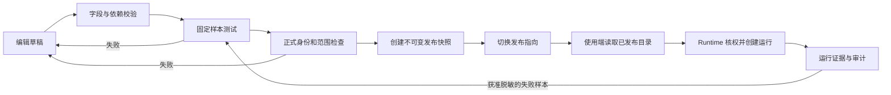
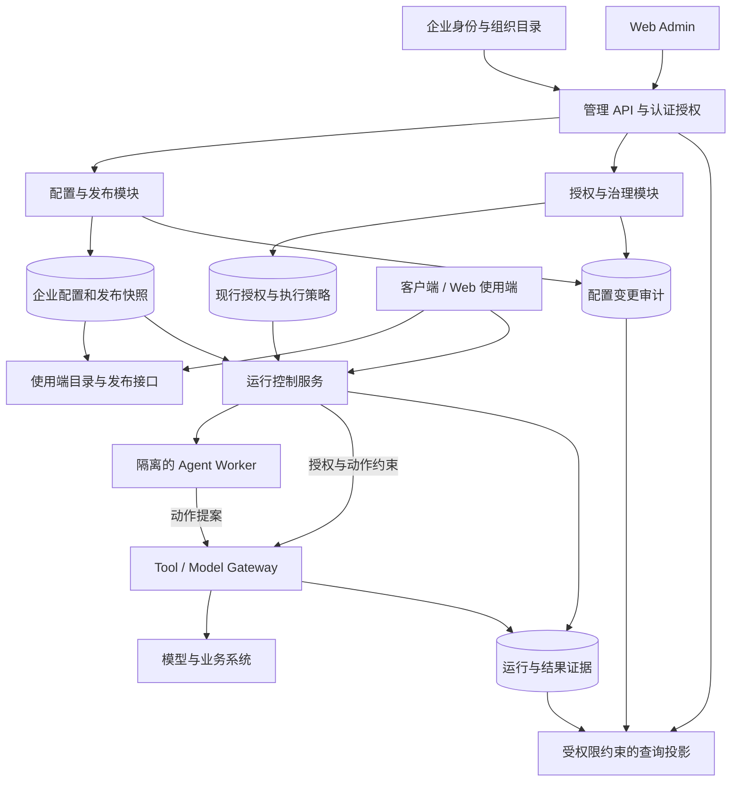

# 企业 AI 系统管理后台调研与架构建议

日期：2026-09-14

状态：调研与方案建议，未冻结产品规格，未实现后台

工作分支：`web-admin`

分支基线：`7bc4621e81d9b3960d4214863a650c92d818fe22`

## 1. 核心结论

建议把企业 AI 后台定位为：**管理企业 AI 资产、发布可用能力、约束运行权限，并追踪结果与责任的控制系统。**

结构上复用传统 SaaS 的组织、权限、资源管理、配置变更和审计机制；Agent 领域增加配置版本、依赖绑定、测试评估、执行身份、发布快照和运行证据。页面结构可以采用成熟后台范式，但发布与执行不能仅按普通 CRUD 处理。

本项目的优先建议：

1. **先建设单企业的管理员后台。** 建立明确的组织归属和数据范围；跨企业运营、商业订阅和自动开通作为后续能力。本轮尚未确认实际部署形态，这是建议而非已决定范围。
2. **保持统一 Agent 对象。** 专家、场景协调者、业务执行者表达用途与可调用方式，复用配置、测试、版本、授权能力；无需建立三套 Agent 表和编辑器。
3. **后台统一维护组织配置，使用端消费发布结果。** 配置内容、发布指向、授权规则和运行状态分别有明确事实源。
4. **先贯通单 Agent 的配置到运行闭环。** 固定成员专家团可随后接入，自由拖拽编排和运行中动态扩编后置。
5. **工程上优先模块化服务端，执行 Worker 隔离。** 业务模块边界清楚即可，不因竞品使用微服务就立即复制其部署复杂度。

以上是结合本项目推导的建议。下面将官方确认的产品机制、现有代码事实和本项目设计建议分开说明。

## 2. 调研方法与证据边界

本轮通过 Agent Reach 的 Exa 搜索和 Jina 网页阅读，并使用网页搜索交叉检索，查阅了 20 个官方文档或官方仓库页面。覆盖 Dify、Coze Studio、LangSmith、Amazon Bedrock、Microsoft Foundry、AWS SaaS Lens、Azure Architecture Center、WorkOS、React-admin 和 MCP 规范。

- 重点研究管理对象、权限模型、版本发布、运行治理与 SaaS 分层；没有按宣传清单进行功能排名。
- 没有登录各产品控制台逐项操作，也没有部署竞品、验证商业版本权益或完成性能评测。官方文档能力不等同于本项目已实现能力。
- Dify self-host 新 Agent、Dify Cloud Chatflow/Workflow、Dify Enterprise 3.11.x 分开记录；LangSmith Deployment 与开源 LangGraph 分开记录；Bedrock Agents 与 AgentCore 不混用结论。
- 没有引用搜索引擎生成的日期作为产品发布日期。所有引用只表示本次访问日可读到的文档内容。
- Ant Design Pro 页面读取只返回标题，没有足够正文，因此未用于具体功能结论。Agent Reach 更新检查受到 GitHub API 限流，不影响已获取资料。
- 本报告是研究产物，不修改现有产品规格。进入实现前需要据此形成后台 Spec，明确与既有客户端需求的关系。

### 2.1 本地工程事实

当前主目录有较多未提交修改，因此新建了独立工作目录 `/Users/kakarrot/Dev/AI Employee OS-web-admin`，基于当前 `main` 提交创建 `web-admin`。原工作目录仍在 `main`，未合并或搬移其未提交内容。

| 当前可确认事实 | 证据 | 对后台的含义 |
| --- | --- | --- |
| 已提交产品定位仍是 Local-first 个人 Agent 团队工作台 | [README](../../README.md)、[产品规格](../product-spec.md) | 企业管理是产品边界扩展，不能只换一个 Web 外壳就宣称企业化完成 |
| 当前是 Electron、React、TypeScript 客户端与本地 Runtime | [package.json](../../package.json)、[系统架构](../system-architecture.md) | 可复用领域约束；浏览器接入、身份认证和服务端运行仍需设计 |
| 有 Employee、EmployeeVersion、AgentCapabilityVersion、TestCase、SandboxTestRun | [domain.ts](../../src/runtime/domain.ts) | 已有 Agent 治理基础；优先扩展映射，避免另建平行配置模型 |
| 已有草稿编辑、测试确认、发布、回滚、停用、归档、受限删除 | [employee-service.ts](../../src/runtime/employee-service.ts) | 应检查并复用业务校验，后台不能绕过服务只改状态字段 |
| 发布检查依赖可用和关联测试通过；测试提示明确不执行真实 Tool | [employee-service.ts](../../src/runtime/employee-service.ts) | 已有测试不证明企业正式身份、外部工具权限与副作用链路通过 |
| 本地 SQLite 有不可变对象和追加式审计约束 | [store.ts](../../src/runtime/store.ts) | 可复用不可变与审计语义；所读存储没有企业租户字段，不能视为多租户数据库 |
| 有 RunGrant、Approval、ToolAction 与 `result_unknown` | [domain.ts](../../src/runtime/domain.ts)、[tool-gateway.ts](../../src/runtime/tool-gateway.ts) | 应保持执行约束与结果核验，不让后台直接覆盖业务成功状态 |
| 模型输入仍是两个精确 ID 的联合类型 | [employee-contract.ts](../../src/shared/employee-contract.ts) | 企业模型服务目录需要独立契约，不能仅给前端加任意字符串输入 |

原工作目录另外存在未跟踪的 `docs/client-requirements-plan.md` 和 `docs/PRD-digital-employee-frontend.md`。前者规划通用企业能力，后者收敛到前后台配置贯通与 Teams 会议，并明确将用户权限、平台监控等排除在该期之外。本报告只读取其背景，没有复制进新分支，也不把本次完整企业后台研究反向加入会议 MVP。两者的产品范围应在后台 Spec 中明确衔接。

本轮只核查相关源码和文档，没有重新执行 Runtime、真实模型或客户端验收。

## 3. Agent 平台的代表性机制

| 参考对象 | 官方文档确认的机制 | 对本项目的启发 | 适用边界 |
| --- | --- | --- | --- |
| Dify 工作空间 | 应用、知识、成员、模型配置与集成归属工作空间 | 共用资源目录和组织归属，Agent 配置通过引用选择资源 | 工作空间模型不自动等同于企业部门或完整 SaaS 租户模型。[S01](https://docs.dify.ai/en/self-host/use-dify/workspace/readme) |
| Dify 新 Agent | 配置模型、Prompt、Skill、Tool；草稿发布；共享 Skill 跟随最新发布版本；DSL 不包含嵌入 Skill 和文件 | 配置需分组；发布应展示依赖锁定范围和导出完整性 | 来自 self-host 新 Agent 页面；不能据此推断所有历史版本行为。[S02](https://docs.dify.ai/en/self-host/use-dify/build/new-agent/build) |
| Dify Cloud 版本控制 | Chatflow/Workflow 区分草稿与发布版本，恢复旧版到草稿后可再发布；部分版本操作依赖付费计划 | 恢复草稿与切换线上版本应是两个不同动作 | 页面明确限定 Chatflow/Workflow，不能推广到全部 Agent 类型。[S03](https://docs.dify.ai/en/cloud/use-dify/build/version-control) |
| Dify Enterprise | 区分查看、编辑、测试、发布、日志、删除等权限，并叠加资源可达范围 | 权限应包含动作和资源范围，创建者不必天然拥有发布权 | 引用 Enterprise 3.11.x，不归入社区版能力。[S04](https://enterprise-docs.dify.ai/en/3.11.x/use/workspace/permission-reference) |
| LangSmith Assistants | 同一 Graph 复用不同配置；配置独立版本化，可切换当前版本 | 区分执行程序、Agent 配置及部署；改 Prompt 无需复制整套执行逻辑 | Assistants 属于 LangSmith Deployment，并非开源 LangGraph 自带管理后台。[S05](https://docs.langchain.com/langsmith/assistants) |
| LangSmith Evaluation | 测试集上的离线评估与线上 Run/Thread 评估分开，线上问题可沉淀为回归样本 | 测试、正式运行和质量评价关联但不混为同一记录 | 线上评分不等于外部业务结果核验。[S06](https://docs.langchain.com/langsmith/evaluation-concepts) |
| Amazon Bedrock Agents | 不可变版本加 Alias；客户端调用稳定别名；别名可指向旧版本或拒绝新调用 | 把版本内容和发布指向分开；回滚不要求客户端修改版本号 | 这是 Bedrock Agents 机制，不是 AgentCore 全部能力说明。[S07](https://docs.aws.amazon.com/bedrock/latest/userguide/deploy-agent.html) |
| Microsoft Foundry | Agent Application 提供稳定入口和部署对象；发布后拥有独立执行身份，依赖权限需要重新分配 | 发布检查覆盖正式身份、凭据、工具和访问范围 | 文档当前应用支持一个活动 Deployment；不据此声称有百分比灰度。[S08](https://learn.microsoft.com/en-us/azure/foundry/agents/how-to/agent-applications)、[S09](https://learn.microsoft.com/en-us/azure/foundry/agents/concepts/agent-identity) |
| Foundry Control Plane | 统一 Agent 资产清单、生命周期和运行观测；外部 Agent 需注册，观测依赖监控接入和权限 | 建设资产登记与运行定位能力，允许未来纳管外部运行环境 | 资产可见不代表所有类型都具备完整 Trace 或所有控制动作。[S10](https://learn.microsoft.com/en-us/azure/foundry/control-plane/how-to-manage-agents) |
| Coze Studio | Agent、应用、Workflow、模型服务和插件/知识等资源各有管理入口，提供 API/SDK | 业务编排与可复用能力资源分开，避免塞入 Agent 单个表单 | 官方仓库可供后续代码复用评估，本轮未完成开源二开选型。[S11](https://github.com/coze-dev/coze-studio) |

可以提炼的共同结构是：**组织/工作空间 → 可复用资源 → Agent 配置 → 测试 → 发布入口 → 运行记录**。这是一种跨产品归纳，不表示所有产品采用完全相同的数据模型。

## 4. 传统企业 SaaS 后台应借鉴什么

### 4.1 先区分三类使用者

| 层次 | 典型使用者 | 管理内容 | 本项目首期建议 |
| --- | --- | --- | --- |
| 平台运营层 | 软件提供方运营、平台运维 | 企业开通/停用、部署、套餐、跨企业容量、故障处理 | 暂不建设完整运营控制台 |
| 企业管理层 | 企业系统管理员、配置者、发布者、审查者 | 企业成员授权、Agent、共享资源、发布和治理 | 本次 web-admin 主体 |
| 业务使用层 | 企业员工、业务责任人 | 调用已发布能力、提交输入、处理本人确认、验收结果 | 既有客户端及 Web 使用端 |

Azure 的多租户架构文档明确区分控制面与数据面，并指出控制面可从简单租户元数据逐步演进为自动开通和资源治理系统。因此首期不必一次建设完整 SaaS 商业平台。[S12](https://learn.microsoft.com/en-us/azure/architecture/guide/multitenant/considerations/control-planes)

### 4.2 组织、工作空间、部门和环境分别建模

| 对象 | 回答的问题 | 建议边界 |
| --- | --- | --- |
| Organization / Tenant | 数据和管理责任属于哪个企业 | 即使单企业部署，也给企业资产明确归属；跨企业隔离必须在服务端实现 |
| Workspace / Project | 哪个团队共建这批能力 | 是资源协作边界；首期可以只有默认工作空间 |
| Department / Group | 人员来自哪个组织单元或授权群组 | 来源于身份/组织目录；不要把所有外部 Group 自动当作部门 |
| Environment | 测试还是正式运行 | 约束凭据、发布指向、数据和预算；不是另一家企业 |

AWS SaaS Lens 将用户与租户上下文结合为 SaaS 身份，并强调租户资源隔离须由系统机制保证。由此推导：菜单隐藏、登录成功或请求自行携带一个 `tenantId`，都不足以证明租户隔离。[S13](https://docs.aws.amazon.com/wellarchitected/latest/saas-lens/saas-identity.html)、[S14](https://docs.aws.amazon.com/wellarchitected/latest/saas-lens/tenant-isolation.html)

若未来做多企业 SaaS，企业开通应作为有状态流程处理：创建企业、关联身份、配置资源、初始化权限、检查可用、开放访问；失败需可定位和恢复。AWS 明确指出租户开通可能由企业自助或平台人员发起，并需要编排多个资源步骤。[S15](https://docs.aws.amazon.com/wellarchitected/latest/saas-lens/tenant-onboarding.html)

### 4.3 身份来源、动作权限、数据范围分开

- **身份来源**：优先接企业现有身份提供方；人员和组织变化由同步或事件进入平台。平台保留映射和同步状态，不反向维护外部人事主数据。WorkOS 展示了 SCIM/目录、用户、Group、开通与撤销的标准接入模式。[S16](https://workos.com/docs/directory-sync)
- **动作权限**：如 `agent.edit`、`agent.test`、`agent.publish`、`connection.rotate`、`run.read`。
- **数据范围**：本企业、指定工作空间、指定 Agent、本人运行、获准审计范围。
- **运行授权**：本次具体动作以谁的身份执行、可读哪些资料、可写哪个系统。这需要 Runtime 再次判断。

WorkOS 把角色关联在组织成员关系上，并支持来自身份系统群组的角色分配。本项目可以借鉴此模型；实际撤权时效仍取决于会话、权限缓存和 Runtime 的失效处理，不能仅凭收到同步事件就宣称所有运行立即失权。[S17](https://workos.com/docs/rbac/integration)

### 4.4 复用成熟页面与 API 分层

传统后台值得复用的界面结构：全局导航、面包屑、列表搜索/筛选/排序/分页、详情页、编辑表单、字段校验、关联对象跳转、变更记录与操作反馈。列表先提供识别与决策所需信息，长 Prompt、依赖明细和 Trace 放入详情。

React-admin 把数据访问和身份接入分别抽象成 `dataProvider` 与 `authProvider`。值得借鉴的是 UI、API 适配和认证逻辑的职责分离，不代表本项目必须采用该框架或其会话存储示例。[S18](https://marmelab.com/react-admin/DataProviderIntroduction.html)、[S19](https://marmelab.com/react-admin/Authentication.html)

服务端保留发布、回滚、撤权等领域命令。它们涉及校验、事务和审计，不宜通过普通 `PATCH status` 任意改写。可继续复用现有 React/TypeScript 和组件基础；具体表格、表单、路由框架在后台页面契约确定后验证选型。

## 5. Agent 后台的核心管理对象

下面是建议领域模型，不是已实现的数据表清单。产品文案使用 Agent，现有代码仍使用 Employee；后续通过明确映射演进，不为统一名称先做全仓重命名。

| 对象 | 自己拥有的事实 | 不应承担的职责 |
| --- | --- | --- |
| Agent | 稳定标识、名称、用途、责任人、归属、停用/归档标记 | 不存放某次运行的成功状态 |
| AgentVersion | Prompt、模型选择、输入输出契约、依赖版本和运行规则 | 不直接存放长期密钥；已发布内容不可编辑 |
| SkillVersion | 可复用方法、说明、文件清单、摘要、来源、所需 Tool | 不能仅凭技能文本扩大执行权限 |
| ToolVersion | 输入输出 Schema、动作类别、风险、超时、执行器、结果核验规则 | 不把连接账号或整个 MCP Server 当成单个无限权限工具 |
| Connection | 服务地址、认证方式、身份主体、凭据引用、健康状态 | 不向前端返回可重用的 Secret 明文 |
| ModelService / Model | 服务端连接、模型目录、能力与可用状态 | 不能把不同服务商的同名模型视为同一部署 |
| KnowledgeBinding | 数据源引用、查询范围、资料权限、索引版本/更新时间 | 不复制一套外部资料所有权，也不默认共享个人记忆 |
| Scenario / ExpertGroup | 业务目标、一个协调 Agent、多个业务 Agent、节点与完成规则、版本 | 引用协调 Agent 的工作规则，不另存一份可独立修改的场景 Prompt |
| Release | 指定环境/渠道指向哪个配置快照，何人何时发布，适用范围 | 切换 Release 不改写旧运行和外部业务结果 |
| Run / ToolAction / Result | 实际版本、身份、动作、回执、状态、证据和用量 | 不以 Agent 自述替代外部结果 |
| AuditEvent / Evaluation | 变更与权限证据；测试样本、评价、失败原因 | 审计不是任意开放全部聊天正文，评分不是结果回执 |

### 5.1 Agent 配置应分为哪些组

| 配置组 | 核心字段 | 必须校验的关系 |
| --- | --- | --- |
| 基本信息 | 名称、职责、说明、用途、业务责任人、归属 | 用途决定可独立调用还是仅在专家团内使用 |
| 工作规则 | System Prompt、职责边界、输入要求、输出与完成条件 | 结构化字段和 Prompt 不形成两套可独立冲突的事实；若生成 Prompt，保留单一生成来源 |
| 模型 | 服务 ID、精确模型/部署 ID、可支持参数、输出上限 | 模型能力与 Tool 调用、结构化输出等实际需要匹配 |
| 技能与工具 | Skill/Tool 版本引用、必需/可选依赖、参数约束 | 所需 Tool 必须在允许范围内；共享能力升级不得静默扩大权限 |
| 连接与身份 | 连接引用、企业服务身份或用户委托身份、正式环境授权状态 | 测试凭据与正式凭据分别校验；账号停用、Scope 缺失须阻断 |
| 知识与记忆 | 数据源范围、检索配置、允许记忆范围、保留与删除规则 | 资料授权和个人数据隔离在读取时仍有效 |
| 运行限制 | 最大步骤、模型/工具超时、并发、预算、重试、人工确认条件 | UI 配置必须由 Runtime 执行；未知结果不进入普通重试 |
| 测试 | 测试集、样本版本、评价标准、实际结果、确认人 | 记录测试所用配置摘要；修改受测配置后旧测试不能继续证明可发布 |
| 发布与使用 | 环境、渠道、发布快照、可见和可调用范围、版本说明 | 可见、可调用、可配置、可发布为不同权限 |
| 运维信息 | 当前发布、依赖健康、近期失败、用量、审计 | 明确缺失数据，不能将未接入显示为健康或零成本 |

MCP 是连接与工具调用协议，不替代本产品的业务权限。规范要求 Token 接收方校验目标资源，禁止将收到的客户端 Token 原样透传给上游。本项目应管理精确 Tool 权限、执行身份和授权对象，而不是提供“开通 MCP 即授权所有动作”的开关。[S20](https://modelcontextprotocol.io/specification/2026-07-28/basic/authorization/security-considerations)

## 6. 配置发布与运行治理

### 6.1 四类状态分别展示

| 层次 | 建议表达 | 例子 |
| --- | --- | --- |
| 配置版本状态 | 草稿、待验证、验证通过、已发布历史 | v3 正在编辑，v2 仍是线上版本 |
| 发布状态 | 未发布、可接收调用、停止接收调用 | 停用入口不删除配置 |
| 依赖健康 | 可用、降级、不可用、未检查 | 模型连接失败不是 Agent 草稿丢失 |
| 运行状态 | 执行中、等待输入/确认、暂停、核验中、成功、失败、取消 | 外部返回超时可能是结果未知，不能直接视为未执行 |

状态名称是产品建议，需与现有 `EmployeeVersionState`、`RunState`、`ToolActionState` 制定映射后实施。

### 6.2 建议发布链路

发布快照建议引用 AgentVersion、依赖版本与文件摘要、模型部署、输入输出契约、测试结果、发布人、配置摘要。凭据只保存引用及必要的轮换标识，不把 Secret 写进快照。外部模型、远端工具和可变数据源无法完全冻结时，应明确可变项与实际观测版本；即使配置可追溯，也不承诺每次模型输出相同。

采用“配置内容冻结，现行授权可收紧”的规则：版本回滚不复活已撤销权限；运行持有旧快照也不能绕过当前停用、资料撤权、凭据撤销与安全策略。扩权则不能静默进入既有 Run，须重新形成授权决定。

### 6.3 管理动作如何影响其他模块

| 管理动作 | 新调用 | 已开始运行 | 前台与后台应显示什么 |
| --- | --- | --- | --- |
| 修改已发布 Agent | 继续使用旧发布版本 | 保留原快照 | 显示“存在未发布修改” |
| 发布新版本 | 使用新发布指向 | 保留原快照并继续动态核权 | 显示版本、发布时间、实际运行版本 |
| 回滚发布 | 新调用指向指定旧版本 | 不自动回放、迁移或撤销外部动作 | 展示回滚理由、操作者和受影响范围 |
| 普通停用 | 拒绝新调用 | 是否继续按显式策略处理；不能把停用等同于取消全部任务 | 展示存量运行数量和处理方式 |
| 撤销权限或紧急封禁 | 拒绝受影响调用 | 在下一受控动作阻断；在途外部动作先核验 | 显示阻断原因、负责人、已发生动作 |
| Tool/模型不可用 | 阻断必需依赖；可选依赖按明确策略降级 | 暂停、失败或交人处理，按错误类别判断 | 展示受影响 Agent、专家团和运行 |
| 外部写入超时、结果未知 | 不因重试创建重复操作 | 按原操作标识查询回执或人工核验 | 维持“结果待核实”，保留证据 |
| 删除配置 | 被发布、依赖或历史引用的对象不硬删除 | 保持历史引用可解释 | 优先归档；纯草稿且无引用才允许删除 |

冻结配置与现行授权检查必须同时成立。特别是客户端离线或使用缓存目录时，目录可见性不代表仍具备执行权；无法验证企业高影响动作授权时，不应继续执行。

## 7. 建议权限模型与角色分工

权限判断应在 API 和 Runtime 执行边界完成。下面是候选职责矩阵，同一人可在首期承担多个角色，但权限记录仍分开。

| 操作 | 企业管理员 | 能力配置者 | 发布者 | 运行审查者 | 普通员工 |
| --- | --- | --- | --- | --- | --- |
| 管理成员和角色 | 企业范围 | 否 | 否 | 只读获准元数据 | 本人信息 |
| 管理模型、连接和凭据引用 | 有专项授权时 | 使用获准资源 | 检查发布依赖 | 查看脱敏状态 | 查看本人连接状态 |
| 编辑 Agent/专家团 | 可委派 | 指定资源 | 获准时 | 否 | 否 |
| 执行测试 | 有测试授权时 | 指定资源与测试环境 | 发布验证 | 查看获准测试结果 | 否 |
| 发布、回滚、停止新调用 | 有发布授权时 | 默认否 | 指定资源 | 否 | 否 |
| 查看运行与审计 | 按治理范围 | 本人测试或获准运行 | 发布关联记录 | 指定范围 | 本人/参与事项 |
| 读取私人正文或敏感产物 | 不默认授权 | 不默认授权 | 不默认授权 | 需额外内容访问授权 | 按业务数据权限 |
| 代业务人员确认动作或修改业务结果 | 否 | 否 | 否 | 否 | 仅本人责任范围 |

每个 ToolAction 至少要可追溯：发起用户、企业、执行 Agent、Agent 版本、运行 ID、实际执行身份、目标资源、授权范围、人工决定、外部回执。以企业服务账号运行与代表用户运行需要不同授权路径，不能共享一个含义模糊的“管理员权限”。

## 8. 建议后台信息架构

首期采用七个一级入口。该结构保留已有数字员工后台设计中熟悉的命名，是本报告的候选组织方式，不代表迁移或上线了其他仓库的原型。

| 一级入口 | 二级内容 | 优先交付内容 |
| --- | --- | --- |
| 总览 | 待处理发布、依赖异常、运行异常、基本使用情况 | 从实际记录派生，未接入显示未接入 |
| 用户与权限 | 成员、组织/群组映射、角色、资源授权 | 企业身份接入和必要固定角色；复杂角色设计器后置 |
| 智能体中心 | Agent 列表、详情、配置、测试、版本 | 主工作区；专家/协调/业务用途通过筛选和调用规则区分 |
| 能力中心 | Skill、Tool、知识绑定 | 共享资源和依赖管理；MCP 归入工具连接详情 |
| 业务中心 | 专家团/场景、固定节点、参与者引用、版本 | 先固定成员与串行规则，复用 Agent 配置和发布基础 |
| 运行中心 | 业务办理记录、普通聊天记录、审计记录 | 默认只读；技术 Trace 放详情并单独授权 |
| 系统设置 | 模型服务、连接与凭据、运行策略、用量与保留设置 | 模型与连接优先；完整商业计费后置 |

Agent 列表建议显示：名称与职责、用途、责任人、当前发布版本、配置/启停状态、依赖异常、更新时间、操作。长 Prompt、完整工具集合和详细运行轨迹不放在主表。

Agent 详情建议采用：概览、配置、测试、版本与发布、关联对象、运行记录、变更记录。创建流程按“基本信息 → 工作规则 → 资源与身份 → 运行约束 → 测试发布”组织，保持已填内容，不为简单字段逐项弹窗。

运行中心以事项/会话记录为入口，按时间查看，再下钻到 Run、ToolAction 与证据。业务人员关心结果和下一步，工程人员关心 Trace；通过授权和详情层级满足两者，不让首页变成原始日志堆积。

## 9. 建议技术架构及与当前工程的衔接

以下是目标方案草案，尚未建设相应 API、服务、数据库或同步机制。

### 9.1 各模块唯一写入责任

- 配置与发布模块写企业 Agent、共享资源引用、版本和发布指向。
- 授权模块写角色、资源范围、执行策略与撤权记录；企业身份主数据仍由外部目录负责。
- Runtime 写运行、动作、审批、结果和用量。管理后台通过命令请求必要控制，不能直接改运行记录。
- 查询层生成目录、运行列表、指标和审计视图；投影可以重建，不成为第二份业务事实。
- Worker 提出模型与 Tool 请求；Gateway 在实际执行前检查运行授权、精确资源和最新限制。

原架构把 Local Control Runtime 作为本地产品数据的唯一写入者。上图属于企业化扩展：实现时必须明确哪些组织配置转为服务端主存、客户端保存何种只读快照、Runtime 如何引用它；不能让本地与服务端同时拥有可写主副本。

### 9.2 首期物理部署保持简单

建议以一个模块化管理服务承载配置、发布、组织授权和查询 API；耗时测试/运行由独立 Worker 处理，业务副作用经受控 Gateway。控制面与执行面划清权限和资源边界，后续按规模拆服务。

企业共享元数据可评估关系型服务端数据库，文件与产物用对象存储，密钥交由服务端 Secret 存储。现有 SQLite 可继续服务本地 Runtime 或缓存，但不能让多台浏览器直接共享一个桌面数据库文件。本轮不新增数据库、消息队列、Kubernetes 或特定云厂商依赖。

### 9.3 在实现前确定运行位置

| 路线 | 优点 | 额外成本 | 适用条件 |
| --- | --- | --- | --- |
| 企业服务端集中运行 | 发布、授权、审计和连接较易统一 | 现有本机文件工具、Keychain 和本地记忆需要重新划定边界 | 首期主要调用企业 API 和服务端资料；建议优先验证 |
| 本地 Runtime 接企业控制面 | 更直接延用本机资料与桌面能力 | 要解决设备身份、版本同步、离线策略、撤权和证据回传 | 本机文件执行是核心业务条件 |
| 混合运行 | 同时支持企业 API 与本机任务 | 调度、权限、数据路径与故障恢复最复杂 | 单一路线验证后确有需求再建设 |

用户本轮没有确定运行位置和部署方式。本报告不据此直接迁移 Runtime。无论采用哪条路线，后台作为组织配置主入口、版本引用和执行权限检查的原则一致。

### 9.4 关键 API 应有明确语义

建议区分读接口与命令接口，例如“读取 Agent 详情”“保存草稿”“开始测试”“发布指定草稿”“回滚发布”“撤销访问”。接口需统一分页、过滤、字段错误、冲突错误和可追溯请求 ID。

草稿保存应带修订号防止多人覆盖；发布要绑定预期草稿摘要和测试证据。创建版本、切换发布指向及配置审计在事务边界内一致；异步任务和事件投影有幂等标识。浏览器超时后查询命令结果，不盲目重复发布或重放业务写入。

## 10. 建议交付顺序与验收

这些阶段表达依赖顺序，不代表已经承诺工期。完整企业后台目标与当前会议 MVP 分别管理，不能用下表扩大会议交付范围。

| 阶段 | 交付 | 可核对的完成标准 |
| --- | --- | --- |
| 0：后台契约 | 角色范围、对象归属、菜单、配置发布状态、运行位置方案、API 草案 | 所有关键字段有事实源；正常与异常流程可逐项审查 |
| 1：单 Agent 闭环 | 必要身份与权限、模型/连接、草稿、测试、发布、前台目录 | 从空配置开始创建一个 Agent，前台调用同一发布快照，结果有记录 |
| 2：共享能力与专家团 | Skill/Tool 资源、固定专家团、依赖检查、版本影响 | 缺失/错误用途的依赖阻止发布；新旧运行正确引用版本 |
| 3：企业治理完善 | 目录同步、资源授权、运行审查、用量与异常、撤权验证 | 跨范围访问被拒绝；运行与审计可追溯；撤权影响可验证 |
| 后续：按需求扩展 | 跨企业运营、订阅计费、复杂编排、灰度、外部 Agent 纳管 | 有真实需求和约束后另立范围 |

必要验收场景：

1. 管理员配置模型与连接 → 配置者建立 Agent → 测试 → 发布 → 员工发现并使用 → 后台定位到实际版本和结果。
2. 改 Prompt 或 Tool 依赖后，旧测试不再作为新草稿的发布凭证。
3. 测试环境能运行但正式身份缺少 Scope 时，发布被阻止并指出具体资源。
4. v2 发布后新运行使用 v2，既有运行保留 v1；回滚只改变后续调用指向。
5. 配置者没有发布权，直接请求发布 API 也失败；查看权限不隐含调用权限。
6. 用户被移除或资料授权被撤销，刷新列表、直接 API、缓存入口和运行中的后续 Tool 调用均按策略处理。
7. 外部写入超时，使用原操作标识核验，不创建第二个动作冒充恢复。
8. 停用被多个专家团引用的 Tool，后台能定位受影响配置和存量运行，前台不继续显示完全可用。
9. 同时编辑或重复提交发布时，不丢失他人修改，不生成不一致的发布指向与审计。
10. 运行审查者能看到被授权的证据；没有额外授权时无法读取私人聊天正文或 Secret。
11. 未获得实际用量或成本时显示“未知/未接入”；如展示估算，标明估算来源，不混入实际账单。
12. 如果进入多企业阶段，增加跨企业 API、下载、检索、缓存、任务队列和审计隔离负例；仅新增租户下拉框不能通过验收。

## 11. 进入 Spec 时要确定的事项

| 决策 | 本报告建议 | 什么条件会改变建议 |
| --- | --- | --- |
| 首期管理对象 | 单企业管理员后台 | 已确定向多个客户提供共享 SaaS、需要企业自助开通 |
| 运行位置 | 优先验证服务端运行，同时保留本地路线对照 | 必须直接处理本机文件、离线任务或设备专属连接 |
| Agent 对象关系 | 一套 Agent 模型，通过用途和调用权限区分角色 | 某类对象有独立生命周期或完全不同配置契约的真实证据 |
| 配置来源 | 企业配置由管理服务维护，客户端只读发布版本 | 个人 Agent 需要独立创作；届时明确个人/组织归属和发布边界 |
| 前台会议需求关系 | 完整后台目标单独立项，首个闭环可服务会议配置 | 用户明确以该会议 MVP 作为本分支的全部范围 |
| 复用方式 | 先复用现有领域规则和组件，借鉴竞品机制 | 开源或托管方案在身份、发布、恢复、成本等代表性验证中明显更合适 |

本轮已完成分支创建、官方资料检索、当前工程关联分析及本报告。下一份交付应是基于明确范围的后台产品 Spec，随后才是实施计划、页面原型和真实前后台接入。
